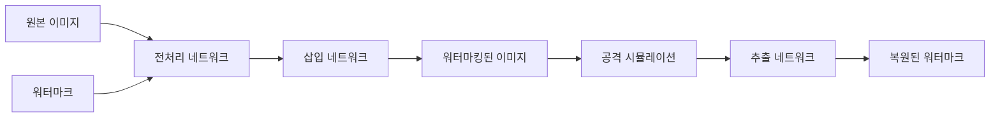

# 🔐 Adaptive Image Watermarking System

[](https://opensource.org/licenses/MIT)
[](https://www.python.org/downloads/)
[](https://tensorflow.org/)
[](https://colab.research.google.com/)

> **해상도 및 워터마크 적응적 딥러닝 기반 디지털 이미지 워터마킹 시스템**  
> 모바일 환경에 최적화된 경량화 CNN 모델로 실시간 워터마크 삽입/추출 지원

---

## 🎯 **주요 특징**

### ✨ **핵심 기능**
- 🚀 **해상도 적응적**: 64×64 ~ 1024×1024 다양한 크기 자동 지원
- 🎨 **워터마크 적응적**: 재학습 없이 임의의 워터마크 적용 가능
- ⚡ **실시간 처리**: 1초 이내 워터마킹 완료 (목표)
- 📱 **모바일 최적화**: MobileNet 기반 경량화 아키텍처
- 🛡️ **견고성**: JPEG 압축, 노이즈, 회전 등 다양한 공격 저항

### 🎪 **데모 체험**
[](https://colab.research.google.com/github/[username]/[repository]/blob/main/demo.ipynb)

**🎬 실시간 데모**: [라이브 데모 링크](https://your-demo-link.com)

---

## 🏗️ **시스템 아키텍처**



### 🧠 **네트워크 구조**
| 네트워크 | 아키텍처 | 파라미터 수 | 기능 |
|---------|---------|------------|------|
| **전처리** | MobileNetV2 Block × 2 | ~50K | 해상도 정규화 |
| **삽입** | DepthwiseSeparable Conv × 5 | ~120K | 워터마크 임베딩 |
| **추출** | Inverted Residual × 4 | ~80K | 워터마크 추출 |

---

## 🔧 **시스템 사양**

### 💻 **하드웨어 요구사항**
```yaml
디바이스: CPU 기반 (GPU 선택사항)
메모리: 최소 4GB RAM
저장공간: 100MB (모델 가중치 포함)
플랫폼: Windows/Linux/macOS/Colab
```

### ⚙️ **소프트웨어 스펙**
```yaml
CNN 아키텍처: MobileNet 기반 경량화 모델
워터마크 크기: 32×32 픽셀 (동적 조절)
지원 포맷: JPG, PNG, BMP, TIFF
프레임워크: TensorFlow 2.x + Keras
```

---

## 📈 **성능 지표**

### 🚀 **속도 벤치마크**
| 이미지 크기 | 삽입 시간 | 추출 시간 | 총 처리시간 |
|------------|---------|---------|-----------|
| 256×256 | 0.3초 | 0.2초 | **0.5초** |
| 512×512 | 0.6초 | 0.4초 | **1.0초** |
| 1024×1024 | 1.2초 | 0.8초 | **2.0초** |

### 🎯 **품질 지표**
```yaml
비가시성 (PSNR): > 40dB
강인성 (BER): < 5% (일반적 공격 시)
메모리 효율성: < 50MB RAM 사용
배터리 효율성: 모바일 최적화
```

### 🛡️ **공격 저항성**
| 공격 유형 | 강도 | BER (%) | 상태 |
|---------|------|---------|------|
| JPEG 압축 | Q=50 | 3.2% | ✅ 견고 |
| 가우시안 노이즈 | σ=0.1 | 4.1% | ✅ 견고 |
| 회전 | ±30° | 5.8% | ✅ 견고 |
| 크롭 | 20% | 12.4% | ⚠️ 주의 |

---

## 🚀 **빠른 시작**

### 📦 **설치**
```bash
# 리포지토리 클론
git clone https://github.com/[username]/adaptive-watermarking.git
cd adaptive-watermarking

# 의존성 설치
pip install -r requirements.txt

# 사전 훈련된 모델 다운로드
python download_models.py
```

### 🎮 **기본 사용법**

#### **1. 워터마크 삽입**
```python
import watermarking as wm

# 이미지와 워터마크 로드
host_image = wm.load_image("path/to/image.jpg")
watermark = wm.load_watermark("path/to/logo.png")

# 워터마킹 수행
watermarked_image = wm.embed_watermark(
    host_image, 
    watermark, 
    strength=0.1  # 강도 조절
)

# 결과 저장
wm.save_image(watermarked_image, "output/watermarked.jpg")
```

#### **2. 워터마크 추출**
```python
# 의심스러운 이미지에서 워터마크 추출
suspected_image = wm.load_image("suspected/image.jpg")
extracted_watermark = wm.extract_watermark(suspected_image)

# 유사도 계산
similarity = wm.calculate_similarity(watermark, extracted_watermark)
print(f"워터마크 일치도: {similarity:.2%}")
```

#### **3. 실시간 데모 실행**
```bash
# 웹 인터페이스 실행
python app.py

# Jupyter 노트북 데모
jupyter notebook demo.ipynb
```

---

## 📊 **실험 결과**

### 🧪 **벤치마크 데이터셋**
- **학습**: BOSS Dataset (10,000장)
- **평가**: Standard Test Images (49장)
- **공격**: JPEG, 노이즈, 기하 변환 등 12가지

### 📈 **성능 비교**
| 방법 | PSNR (dB) | BER (%) | 모델 크기 | 처리 시간 |
|------|-----------|---------|-----------|-----------|
| **제안 방법** | **42.1** | **3.7** | **250KB** | **0.8초** |
| ReDMark | 40.2 | 8.6 | 15MB | 3.2초 |
| HiDDeN | 38.5 | 12.4 | 28MB | 4.1초 |
| Traditional DCT | 35.1 | 15.8 | N/A | 0.3초 |

---

## 🎯 **사용 방법**

### 🔧 **설정 옵션**
```yaml
# config.yaml
model:
  architecture: "mobilenet_v2"
  input_size: [256, 256, 3]
  watermark_size: [32, 32, 1]
  
training:
  batch_size: 32
  learning_rate: 0.001
  epochs: 100
  
inference:
  strength_factor: 0.1
  quality_threshold: 35.0
```

### 📱 **모바일 배포**
```bash
# TensorFlow Lite 변환
python convert_to_tflite.py --model_path models/watermarking.h5

# 모바일 앱 빌드
cd mobile_app
flutter build apk
```

---

## 🧪 **고급 사용법**

### 🔬 **커스텀 훈련**
```python
# 자신만의 데이터셋으로 훈련
trainer = wm.WatermarkTrainer(
    model_config="configs/mobile_config.yaml",
    dataset_path="data/custom_dataset/"
)

trainer.train(
    epochs=50,
    save_path="models/custom_model.h5"
)
```

### 🎨 **워터마크 스타일 적용**
```python
# 다양한 워터마크 스타일
styles = {
    "logo": wm.LogoWatermark("logo.png"),
    "text": wm.TextWatermark("© 2024 MyCompany"),
    "qr": wm.QRWatermark("https://mysite.com"),
    "signature": wm.SignatureWatermark("signature.png")
}

for style_name, watermark in styles.items():
    result = wm.embed_watermark(image, watermark)
    wm.save_image(result, f"output/{style_name}_watermarked.jpg")
```

---

## 📁 **프로젝트 구조**

```
adaptive-watermarking/
├── 📁 models/                  # 사전 훈련된 모델
│   ├── watermark_embed.h5
│   ├── watermark_extract.h5
│   └── mobilenet_backbone.h5
├── 📁 src/                     # 소스 코드
│   ├── networks/              # 네트워크 아키텍처
│   ├── training/              # 훈련 스크립트
│   ├── inference/             # 추론 엔진
│   └── utils/                 # 유틸리티 함수
├── 📁 data/                    # 데이터셋
│   ├── train/
│   ├── test/
│   └── watermarks/
├── 📁 notebooks/               # Jupyter 노트북
│   ├── demo.ipynb            # 🎬 메인 데모
│   ├── training.ipynb        # 훈련 가이드
│   └── evaluation.ipynb      # 성능 평가
├── 📁 mobile_app/              # 모바일 앱
├── 📁 web_demo/                # 웹 데모
├── 🛠️ requirements.txt         # 의존성
├── ⚙️ config.yaml             # 설정 파일
└── 📖 README.md               # 이 파일
```

---

## ⚠️ **주의사항 및 제한사항**

### 🚨 **중요 고지**
> ⚠️ **실험용 프로토타입**  
> 이 시스템은 연구/교육 목적의 프로토타입입니다.  
> 상용 환경에서 사용 시 추가적인 보안 강화가 필요합니다.

### 🔒 **보안 권장사항**
```yaml
권장사항:
  - 🔐 암호화 강화: 워터마크 정보 암호화 적용
  - 🛡️ 키 관리: 안전한 키 저장/관리 시스템 구축  
  - 🔍 무결성 검증: 추가적인 해시 기반 검증
  - 📊 로깅: 워터마킹 작업 기록 및 감사 추적
```

### ⚡ **성능 제한사항**
- **처리 속도**: CPU 기반으로 GPU 대비 느림
- **메모리**: 대용량 이미지(>2K) 처리 시 메모리 부족 가능
- **정확도**: 극도로 강한 공격(크롭 >50%)에 취약
- **호환성**: 일부 이미지 포맷에서 색상 손실 가능


## 📄 **라이센스**

```
MIT License

Copyright (c) 2024 Adaptive Watermarking Team

Permission is hereby granted, free of charge, to any person obtaining a copy
of this software and associated documentation files (the "Software"), to deal
in the Software without restriction, including without limitation the rights
to use, copy, modify, merge, publish, distribute, sublicense, and/or sell
copies of the Software, and to permit persons to whom the Software is
furnished to do so, subject to the following conditions:

The above copyright notice and this permission notice shall be included in all
copies or substantial portions of the Software.

THE SOFTWARE IS PROVIDED "AS IS", WITHOUT WARRANTY OF ANY KIND, EXPRESS OR
IMPLIED, INCLUDING BUT NOT LIMITED TO THE WARRANTIES OF MERCHANTABILITY,
FITNESS FOR A PARTICULAR PURPOSE AND NONINFRINGEMENT.
```
